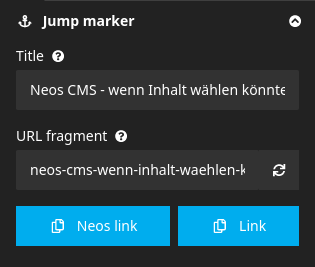

[](https://packagist.org/packages/codeq/neos-link)
[](LICENSE)

# CodeQ.JumpMarkers

This package allows linking to a content node as a jump marker and rendering a jump marker navigation.

## Installation

CodeQ.JumpMarkers is available via packagist run `composer require codeq/jumpmarkers`.
We use semantic versioning so every breaking change will increase the major-version number.

## Configuration

### 1. Extend content nodes with jump marker properties

Add the `CodeQ.JumpMarkers:Mixin.SectionConfiguration` mixin to any content NodeType 
that you would want to link in a jump marker navigation, or as a permalink with a hash.

E.g. this code adds such ability to every Content NodeType:

```yaml
'Neos.Neos:Content':
  superTypes:
    'CodeQ.JumpMarkers:Mixin.SectionConfiguration': true
```



### 2. Make content nodes available in the link search dialog of the backend

Normally, Neos offers only document nodes for selection in its link search dialog. To list the corresponding content 
nodes as well, you must allow this in the link configuration and set nodeTypes to 
`['Neos.Neos:Document', 'CodeQ.JumpMarkers:Mixin.SectionConfiguration']`, for example:

```
'YOUR.Site:Content.Text':
  superTypes:
    'Neos.Neos:Content': true
  ui:
    label: Text
    icon: file-text
    position: 200
    inlineEditable: true
  properties:
    text:
      options:
        ui:
          inline:
            editorOptions:
              linking:
                nodeTypes: ['Neos.Neos:Document', 'CodeQ.JumpMarkers:Mixin.SectionConfiguration']
```

Note that this allows any content node to be selected as a link target, including those that have not yet been assigned 
an anchor id and therefore cannot be linked properly in the frontend.

### 3. Render the anchor id in the frontend

You can either render the id on the item itself with:
```
prototype(Vendor:Site) < prototype(Neos.Neos:ContentComponent) {
    id = CodeQ.JumpMarkers:NodeAnchorId
    renderer = afx`
        <section id={props.id}>
            ...
        </section
    `
```

or you add an anchor before with the `CodeQ.JumpMarkers:AnchorWrapper` processor to the same NodeType renderer
to insert an anchor tag with the given id before it.

E.g.:
```
prototype(Neos.Neos:Content) {
    @process.prependAnchor = CodeQ.JumpMarkers:AnchorWrapper
}
```

### 4. Render the jump marker navigation in the frontend

Here's an example of how to render a jump marker navigation

```
prototype(YOUR.Site:Integration.Organism.HashMenu) < prototype(Neos.Fusion:Component) {
    items = Neos.Fusion:Map {
        items = ${q(documentNode).children('main').children('[instanceof CodeQ.JumpMarkers:Mixin.SectionConfiguration][jumpMarkerTitle][jumpMarkerTitle!=""][_hidden != TRUE]').get()}
        itemName = 'node'
        itemRenderer = CodeQ.Link:Link {
            link = CodeQ.JumpMarkers:NodeAnchorId {
                node = ${node}
                @process.wrap = ${'#' + value}
            }
            label = ${q(node).property('jumpMarkerTitle')}
        }
    }

    renderer = afx`
        <ul class="hash-menu" @if.hasMultiple={Array.length(props.items) > 1}>
            <Neos.Fusion:Loop items={props.items} itemName="item" @children="itemRenderer">
                <li @if.hasName={String.trim(item.label)}>
                    <CodeQ.Link:Tag linkSource={item}>
                        {item.label}
                    </CodeQ.Link:Tag>
                </li>
            </Neos.Fusion:Loop>
        </ul>
    `
}
```

## Usage by editors

### Create jump marker navigation

Enable the jump marker for the content node you want to render in the jump marker navigation by setting a title 
and optionally a manual anchor id.

### Set permalink to content node

Choose some content node that you would like to link to, and fill in the `sectionId` property in the inspector.

Next, either (a) set a link to the content node by selecting the node in a link search dialog, 
or (b) copy the content node's uri to the clipboard via the "Copy Neos link" or "Copy link" button and paste it into 
the "insert link" field in the Aloha editor, and you're done!

## Migration

### Update from v1.0

The property names have changed and some fallbacks were removed, so an automatic migration is not applied.
`CodeQ.JumpMarkers:Mixin.SectionConfiguration.DefaultDisabled` was removed,
`includeInHashMenu` was removed, `hashMenuTitle` was renamed to `jumpMarkerTitle`.

## Credits

This package is heavily inspired by [Flownative.Anchorlinks v1.2.0](https://github.com/flownative/neos-anchorlinks)
with a lot of code copy-pasted, but with a different purpose. Thanks a lot to Flownative for their package!
